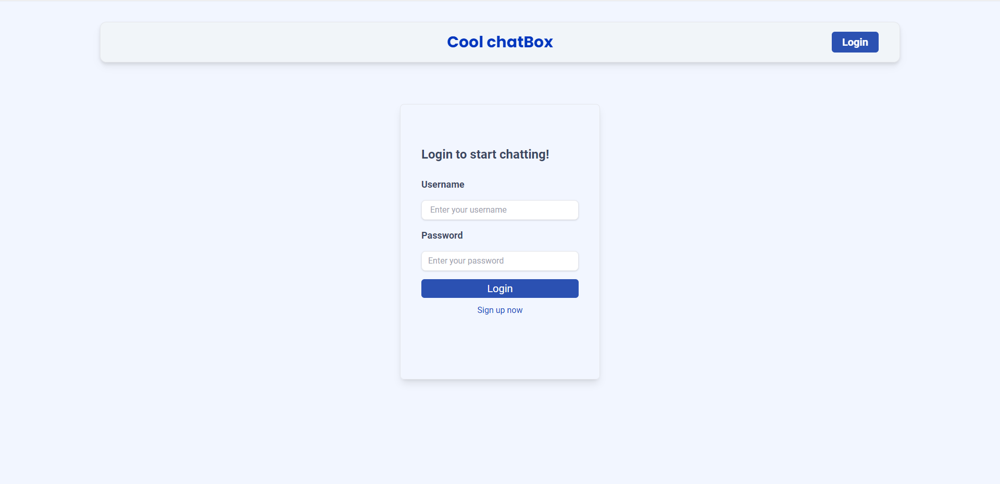
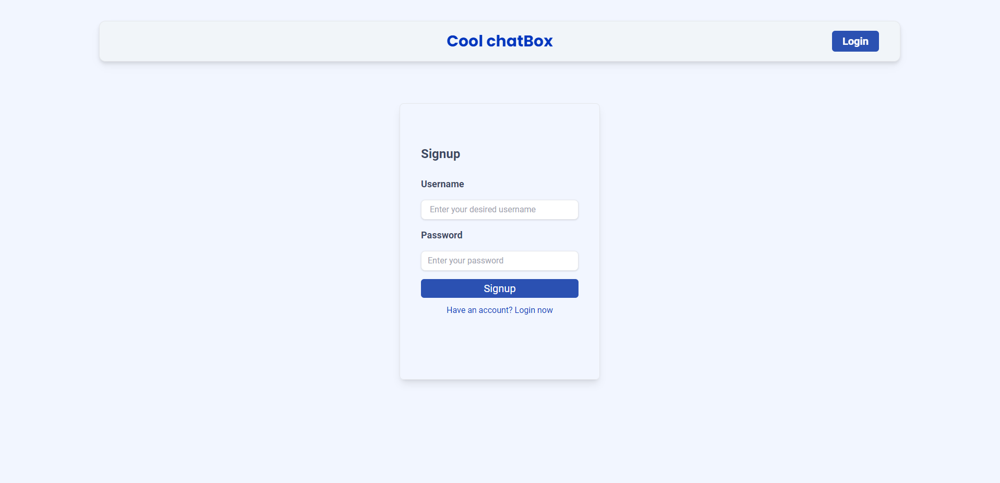
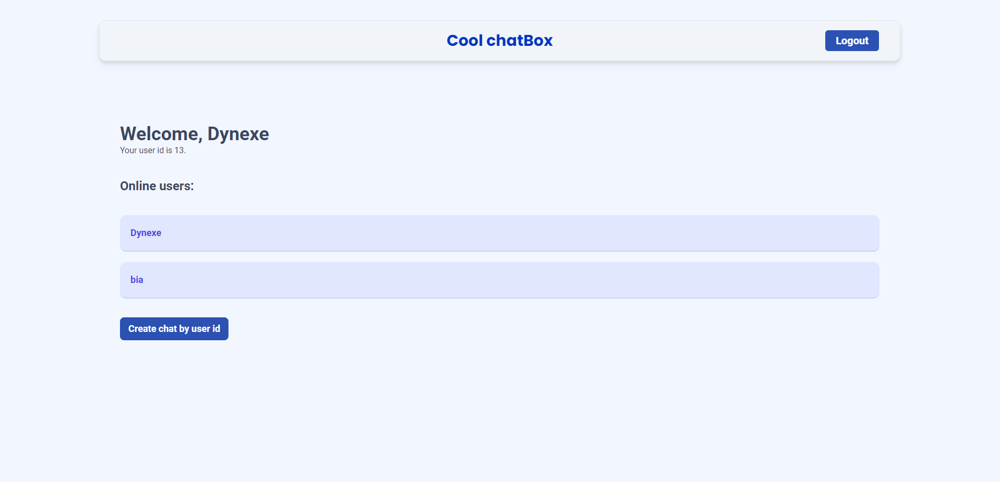
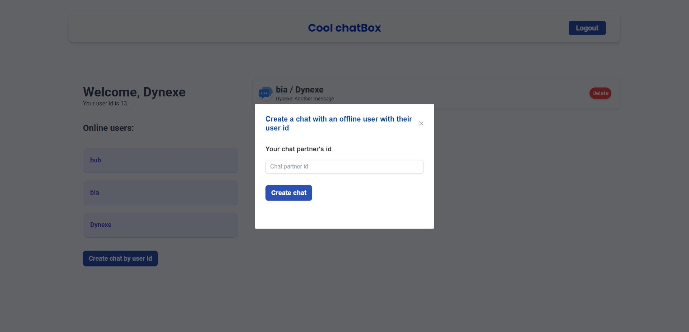
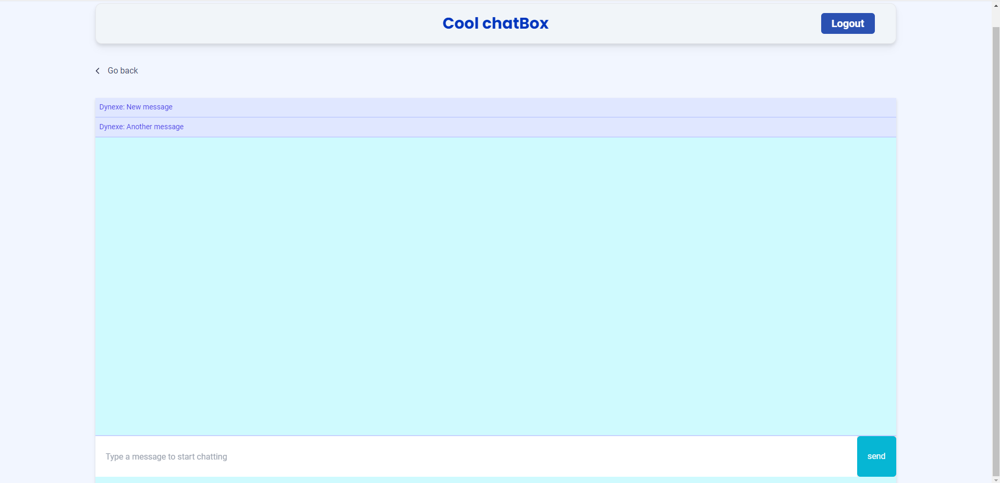

# Cool-Chatbox

## ✏️ Description
 Cool-chatbox is a simple chatbox, Node application that allows you to keep track of your previous chats, messages and create new messages. 
 
## Table Of Contents
- [Installation](#💾-installation)
- [Usage](#💡-usage)
- [Live-Deployment](#📱-live-deployment)
- [Contributing](#👥-contributing)
- [Contributors](#🤖-contributors)
- [Questions](#💭-questions)
- [License](#📚-license)

## 💾 Installation
First clone the repo, on to your computer:

```
git clone
```

Change directories into the cloned repo and run npm install:

```
 npm install
```

Then run the schema.sql file in your mysql to create the database.

You can then run the seeds.js file to populate the database with the initial data.

## 💡 Usage
While in the root directory, run:

```
node index.js
```
or 
```
npm start
```
Then open the brower to http://localhost:3001/. The user will be greeted with a the login page shown below



There are fileds for username and password to login. Clicking 'signup now' will redirect to the signup page shown below



There are fields to enter a new username and a password for that username. Clicking 'Have an account? Login now' will redirect back to the login page. Either logging in or signing up will bring the user to their dashboard. The first shows what it looks like if the user has any previous chats and the second shows what it looks like without and previous chats




On the dashboard on the left the user can see their username, user id and other online users. On the right the users previous chats are displayed if they have any as well as the last message in that chat. Clicking the delete button will remove the chat from the page as well as from the database. Clicking the button anywhere else will reopen the previous chat where the user can view past messages and send new ones. Clicking an online user on the left will open a new chat with that user. A new chat can also be created by clicking the button 'Create chat by user id' which will bring up the modal shown below



On the modal their is a form with input for another user's id. Creating a chat in either way will bring the user to a chat page shown bellow.



The top portion of the chat interface is the chat display where chats are posted. The bottom portion is the chat input where the user will type their message. The blue button to the right is the send button which the user can click when they are done writing their message. Upon sending a message the chat's display will update for both users involed in the chat and the app will emit a tone. Just above the chat display is a button labeled '< Go back' which will bring the user back to their dashboard.

## 📱 Live-Deployment
The live deployment can be found here: https://coolchatbox.herokuapp.com


## 👥 Contributing
To contribute to the Employee Tracker project:
 1. Please first **Fork** the repo on GitHub
 2. **Clone** the project on your computer
 3. **Commit** the changes you would like to see
 4. **Push** to your existing forked project
 5. Finally please submit a **Pull request**

## 🤖 Contributors
-Jordan Pletzer: https://github.com/pletzjd
-Rabia Saheed: https://github.com/zzzbia
 


## 💭 Questions
If you have any questions, please make an issue within the repo. 


## 📚 License
Licensed under [ APACHE](https://opensource.org/licenses/Apache-2)